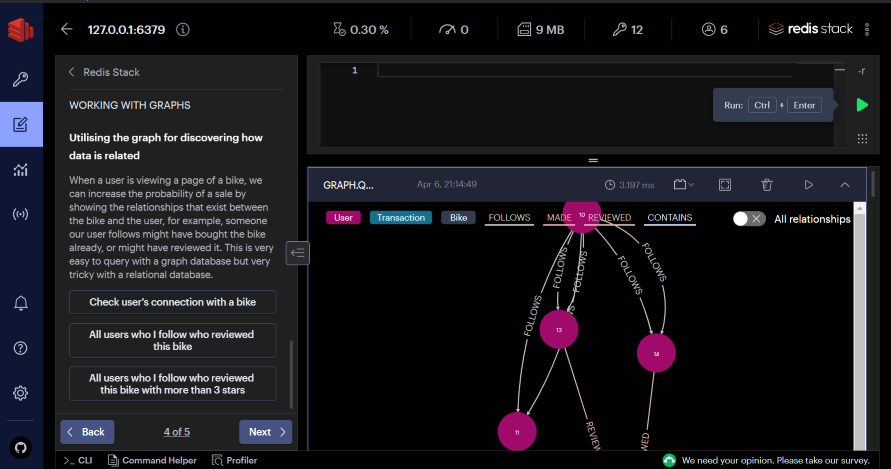
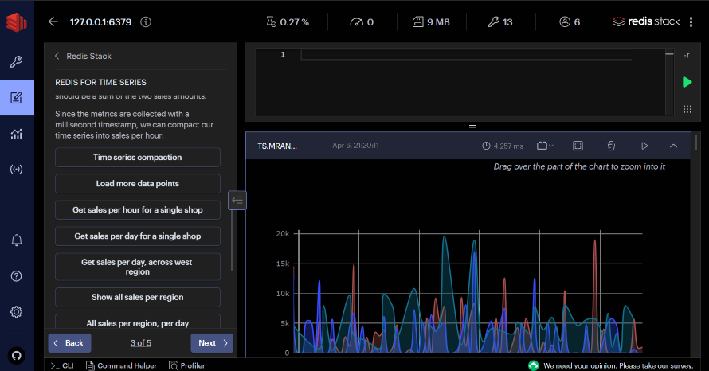

Workbench is a command-line interface with intelligent command auto-complete and complex data visualizations that lets you run commands against your Redis server. 
Find Workbench on the left sidebar. It provides: 

* Built-in examples that help you discover Redis and Redis Stack capabilities using the built-in guides.
* Command auto-complete support for all capabilities in Redis and Redis Stack.
* Visualizations of your [RediSearch](https://oss.redis.com/redisearch/) index, queries, and aggregations.
* Visualizations of your [RedisGraph](https://oss.redis.com/redisgraph/).

  

* Visualizations of your [RedisTimeSeries](https://oss.redis.com/redistimeseries/) data.

  
